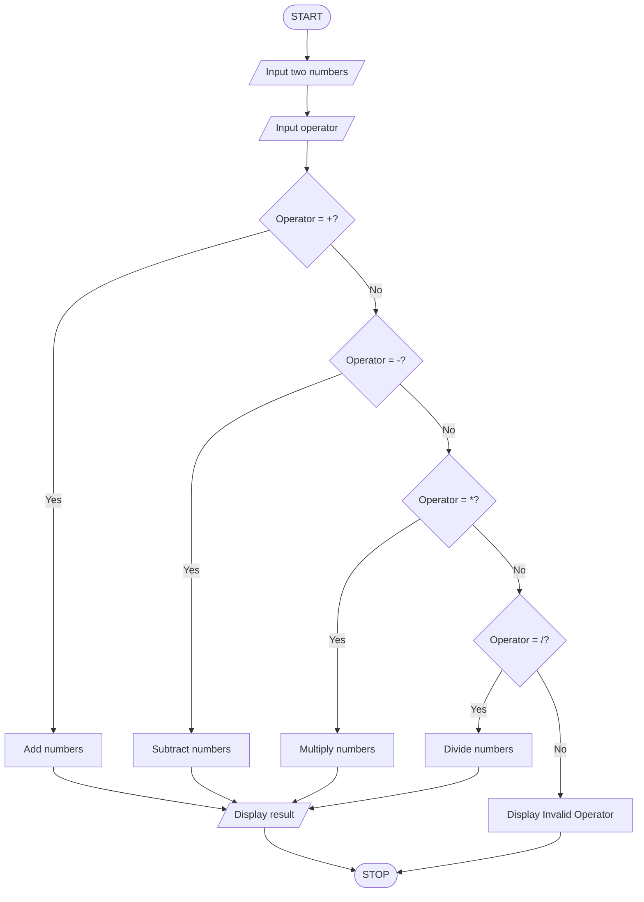

# Flowchart

```mermaid
flowchart TD
    A([START]) --> B[/Input two numbers/]
    B --> C[/Input operator/]
    C --> D{Operator = +?}
    D -- Yes --> E[Add numbers]
    D -- No --> F{Operator = -?}
    F -- Yes --> G[Subtract numbers]
    F -- No --> H{Operator = *?}
    H -- Yes --> I[Multiply numbers]
    H -- No --> J{Operator = /?}
    J -- Yes --> K[Divide numbers]
    J -- No --> L[Display Invalid Operator]
    E --> M[/Display result/]
    G --> M
    I --> M
    K --> M
    L --> N([STOP])
    M --> N
```
