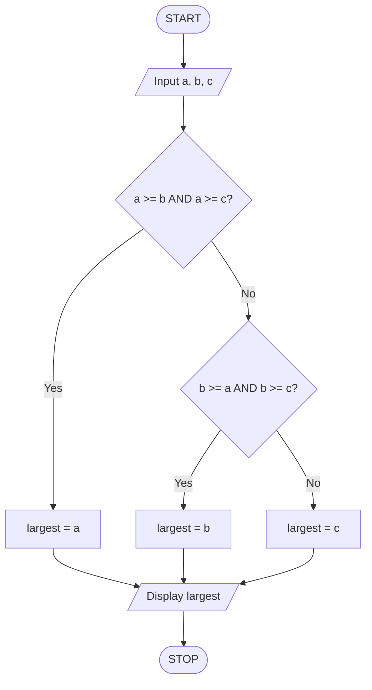

# Flowchart

```mermaid
flowchart TD
    A([START]) --> B[/Input a, b, c/]
    B --> C{a >= b AND a >= c?}
    C -- Yes --> D[largest = a]
    C -- No --> E{b >= a AND b >= c?}
    E -- Yes --> F[largest = b]
    E -- No --> G[largest = c]
    D --> H[/Display largest/]
    F --> H
    G --> H
    H --> I([STOP])
```
