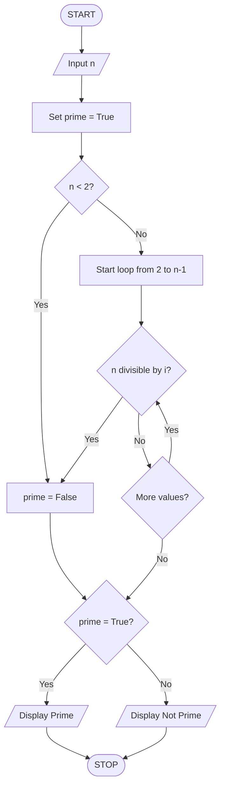

# Flowchart

```mermaid
flowchart TD
    A([START]) --> B[/Input n/]
    B --> C[Set prime = True]
    C --> D{n < 2?}
    D -- Yes --> E[prime = False]
    D -- No --> F[Start loop from 2 to n-1]
    F --> G{n divisible by i?}
    G -- Yes --> E
    G -- No --> H{More values?}
    H -- Yes --> G
    H -- No --> I{prime = True?}
    E --> I
    I -- Yes --> J[/Display Prime/]
    I -- No --> K[/Display Not Prime/]
    J --> L([STOP])
    K --> L
```
