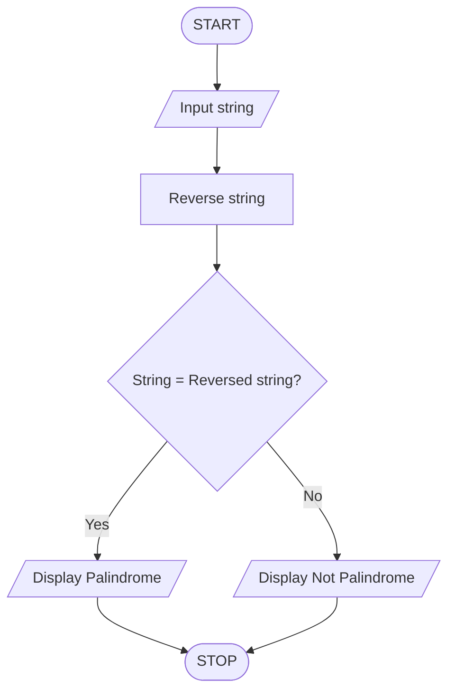

# Flowchart

```mermaid
flowchart TD
    A([START]) --> B[/Input string/]
    B --> C[Reverse string]
    C --> D{String = Reversed string?}
    D -- Yes --> E[/Display Palindrome/]
    D -- No --> F[/Display Not Palindrome/]
    E --> G([STOP])
    F --> G
```
