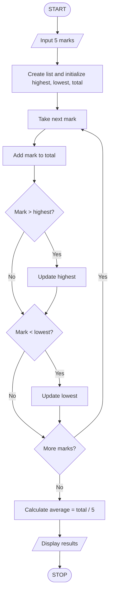

# Flowchart

```mermaid
flowchart TD
    A([START]) --> B[/Input 5 marks/]
    B --> C[Create list and initialize highest, lowest, total]
    C --> D[Take next mark]
    D --> E[Add mark to total]
    E --> F{Mark > highest?}
    F -- Yes --> G[Update highest]
    F -- No --> H{Mark < lowest?}
    G --> H
    H -- Yes --> I[Update lowest]
    H -- No --> J{More marks?}
    I --> J
    J -- Yes --> D
    J -- No --> K[Calculate average = total / 5]
    K --> L[/Display results/]
    L --> M([STOP])
```
