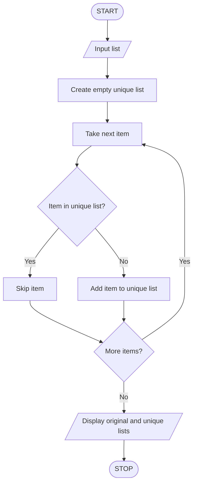

# Flowchart

```mermaid
flowchart TD
    A([START]) --> B[/Input list/]
    B --> C[Create empty unique list]
    C --> D[Take next item]
    D --> E{Item in unique list?}
    E -- Yes --> F[Skip item]
    E -- No --> G[Add item to unique list]
    F --> H{More items?}
    G --> H
    H -- Yes --> D
    H -- No --> I[/Display original and unique lists/]
    I --> J([STOP])
```
