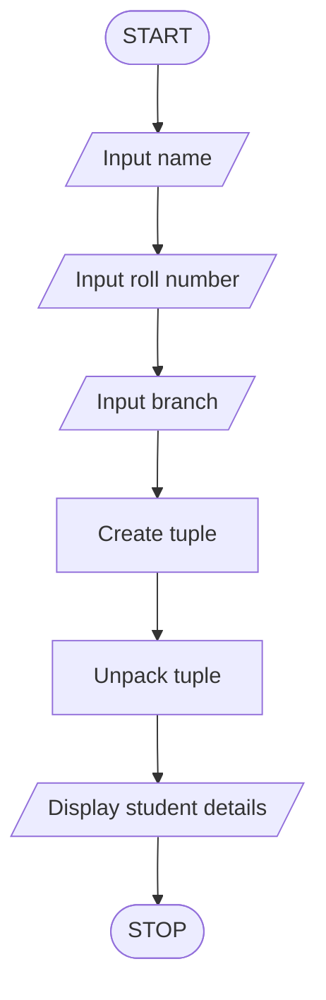

# Flowchart

```mermaid
flowchart TD
    A([START]) --> B[/Input name/]
    B --> C[/Input roll number/]
    C --> D[/Input branch/]
    D --> E[Create tuple]
    E --> F[Unpack tuple]
    F --> G[/Display student details/]
    G --> H([STOP])
```
