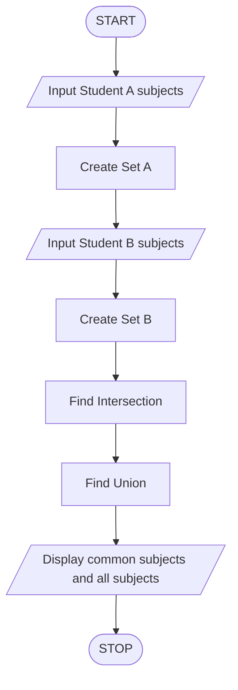

# Flowchart

```mermaid
flowchart TD
    A([START]) --> B[/Input Student A subjects/]
    B --> C[Create Set A]
    C --> D[/Input Student B subjects/]
    D --> E[Create Set B]
    E --> F[Find Intersection]
    F --> G[Find Union]
    G --> H[/Display common subjects and all subjects/]
    H --> I([STOP])
```
